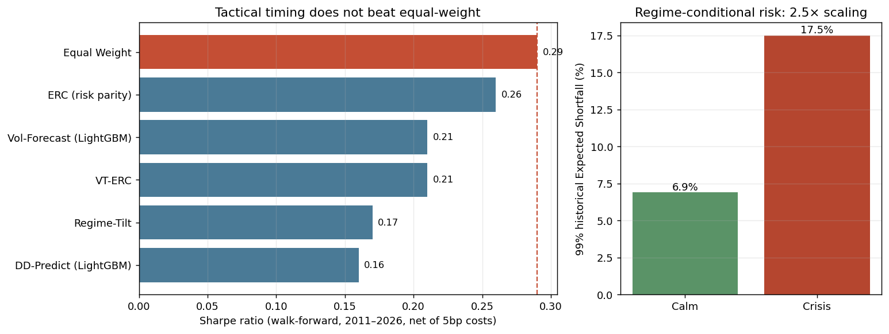

# Macro Regime & Cross-Asset Risk Intelligence Platform

[](https://github.com/ShrishDhuria/macro_regime/actions/workflows/tests.yml)

> A regime-aware macro-financial research framework for European markets.
> Built end-to-end in Python across data infrastructure, regime detection,
> risk analysis, tactical allocation backtesting, stress testing, and an
> interactive dashboard.

---

## Overview

This platform detects macroeconomic regimes across European cross-asset markets, computes regime-conditional risk metrics on a multi-asset portfolio, and tests tactical allocation strategies under realistic walk-forward backtest conditions. It is structured around six phases — data spine, feature engineering, regime detection, risk engine, tactical allocation, stress testing + deliverables — each producing concrete artifacts.

The project's defining characteristic is its commitment to walk-forward methodology, lookahead-bias enforcement, and honest reporting of both positive and negative findings. The backtest results contain a deliberately documented negative finding: at weekly horizon, regime-based and ML-based tactical timing strategies underperform equal-weight, while a risk-parity baseline reduces volatility by ~30% with similar Sharpe. The institutional payoff of the regime detection layer is in *risk monitoring*, not return timing.

---

## Run it in one command

The processed panels and the EONIA history are **committed to the repository**, so
the dashboard and the headline figures work on a fresh clone with no rebuild, no
FRED key, and no network call:

```bash
python -m venv .venv
source .venv/bin/activate          # Windows Git Bash: source .venv/Scripts/activate
pip install -r requirements.txt
streamlit run dashboard/app.py     # opens immediately on the committed panels
```

Re-running the build pipeline (below) is only needed to *refresh* the data or
regenerate the artifacts from scratch.

---

## Key findings



*Left: walk-forward Sharpe by strategy (2011–2026, net of 5bp costs) — every tactical-timing strategy lands below the equal-weight benchmark (dashed line). Right: 99% historical Expected Shortfall by regime — the institutionally useful result. Re-run `python scripts/build_strategies.py` for the full equity-curve and drawdown plots, or `python make_figures.py` to regenerate this summary.*

**Regime detection works.** A 3-state Gaussian Hidden Markov Model on five macro features cleanly identifies every major European macro stress event 2008-2026 — GFC, sovereign crisis, 2015 Bund tantrum, Q1 2016 China/oil, COVID, 2022 inflation/Russia — plus the leading-into-Lehman period 2007-08. Cross-tab against a 2-state baseline shows the third state earns its keep by surfacing transition periods (wider IT-DE spreads, calm equity vol) that pure equity-vol classifiers miss.

**Regime-conditional risk metrics work.** Historical Expected Shortfall at 99% confidence is **6.9% in calm regimes vs 17.5% in crisis** — a 2.5x scaling that an unconditional VaR would mis-price. This is the institutionally credible application of the regime layer.

**99% Cornish-Fisher VaR is 2x the parametric Gaussian VaR.** Portfolio skew -0.80 and excess kurtosis 4.4 (unconditionally) mean Gaussian VaR understates 99% tail risk by more than half.

**Tactical allocation underperformed equal-weight, and we explain why.** Six strategies were walk-forward backtested with 5bp transaction costs and ESTR-financed leverage, scored on a common 2011-2026 window:

| Strategy | Sharpe | Max DD | Ann turnover |
|---|---|---|---|
| Equal Weight | **0.29** | -44.7% | 0% |
| ERC (risk parity) | 0.26 | **-36.7%** | 16% |
| VT-ERC | 0.21 | -40.2% | 24% |
| Regime-Tilt | 0.17 | -43.0% | 30% |
| Vol-Forecast (LightGBM) | 0.21 | -40.2% | 37% |
| DD-Predict (LightGBM classifier) | 0.16 | -40.2% | 206% |

*(The backtest (a) classifies regimes out-of-sample with an annually-refit walk-forward HMM, (b) charges the spliced ESTR rate on leverage instead of assuming it free, and (c) scores all six strategies on the common post-2011 window so the timing strategies are not credited with the pre-signal VT-ERC path through the 2008 GFC. Re-run `build_strategies.py` to regenerate.)*

The regime-tilted strategy failed because the HMM crisis state captures both crash and recovery weeks; crisis-regime annualized return is +20.8% for EW, so cutting equity in crisis sells low and buys high. The drawdown classifier achieved AUC 0.51 — essentially no predictive signal at weekly horizon. **Conclusion: regime detection is a risk-monitoring tool, not a return-timing signal.**

---

## Architecture

```
macro_regime/
├── config/                    # ticker registry
├── data/
│   ├── ingestion/             # yfinance, FRED, ECB fetchers (retry/backoff hardened)
│   ├── alignment.py           # weekly Friday-close harmonization
│   └── storage.py             # parquet I/O
├── features/                  # Phase 2 — 63-feature library
│   ├── returns.py
│   ├── volatility.py
│   ├── spreads.py
│   ├── correlations.py
│   ├── momentum.py
│   ├── macro_lag.py           # publication-lag enforcement
│   ├── freshness.py           # staleness check
│   └── short_rate.py          # ESTR/EONIA splice (cache-first, ESTR-only fallback)
├── regimes/                   # Phase 3 — HMM core
│   ├── data_prep.py
│   ├── hmm_model.py           # multi-seed Gaussian HMM (full-sample)
│   ├── walk_forward_hmm.py    # annually-refit, out-of-sample HMM for tactical use
│   └── diagnostics.py
├── risk/                      # Phase 4 — risk engine
│   ├── portfolio.py
│   ├── var.py                 # historical, parametric, Cornish-Fisher
│   ├── expected_shortfall.py
│   ├── drawdown.py
│   ├── beta.py
│   ├── regime_conditional.py
│   └── excel_export.py        # parallel openpyxl workbook
├── forecast/                  # Phase 5 / 5b — LightGBM models
│   ├── vol_model.py           # walk-forward vol forecast
│   └── drawdown_model.py      # walk-forward classifier
├── portfolio/                 # Phase 5 — allocation rules
│   ├── risk_parity.py         # ERC solver + vol targeting
│   └── weights.py             # tilting functions
├── backtest/                  # Phase 5 — walk-forward engine
│   ├── engine.py
│   └── metrics.py
├── stress/                    # Phase 6 — stress engine
│   ├── scenarios.py
│   └── transmission.py        # empirical-beta-based (warns on skipped scenarios)
├── dashboard/
│   └── app.py                 # Streamlit 4-tab dashboard (runs on committed panels)
├── scripts/                   # orchestrators (one per phase)
│   ├── build_panel.py
│   ├── build_features.py
│   ├── build_regimes.py
│   ├── build_risk.py
│   ├── build_strategies.py
│   ├── build_stress.py
│   └── build_deck.py
├── reports/                   # generated artifacts (PNG, XLSX, PPTX)
├── data_store/
│   ├── raw/                   # gitignored API cache  (EONIA.parquet committed as a seed)
│   └── panel/                 # committed processed panels + features
├── requirements.txt
├── sources.md                 # data provenance audit trail
└── README.md
```

---

## Running the full pipeline (optional)

Each phase has one orchestrator. Run in order; later phases depend on earlier outputs. This is only needed to refresh the data — the committed panels already drive the dashboard.

```bash
py scripts/build_panel.py        # Phase 1 — fetch and align the data spine
py scripts/build_features.py     # Phase 2 — build the 63-feature library
py scripts/build_regimes.py      # Phase 3 — fit 2- and 3-state HMMs with diagnostics
py scripts/build_risk.py         # Phase 4 — risk metrics + Excel workbook
py scripts/build_strategies.py   # Phase 5/5b — six strategies, walk-forward backtest
py scripts/build_stress.py       # Phase 6 — stress testing
py scripts/build_deck.py         # Phase 6 — generate the methodology PowerPoint
streamlit run dashboard/app.py   # Phase 6 — launch the interactive dashboard
```

Total fresh-rebuild runtime: approximately 5-7 minutes on a typical laptop.
(Use `python` instead of `py` on macOS/Linux.)

---

## Phase-by-phase outputs

| Phase | Deliverable | Output |
|---|---|---|
| **1** | Data spine | `data_store/panel/master_panel.parquet` (~1,114 weekly rows, 2005-2026) |
| **2** | Feature library | `data_store/panel/master_features.parquet` (63 features) |
| **3** | HMM regime detection | `regime_overlay_3state.png`, `regime_probabilities_3state.png`, persisted viterbi/probabilities/transitions/emissions |
| **4** | Risk engine | `risk_workbook.xlsx` (4 sheets with named ranges), regime-conditional metrics |
| **5/5b** | Tactical backtest | `strategy_comparison.png`, `strategy_drawdowns.png`, `drawdown_predictions.png`, per-strategy weights + returns |
| **6** | Stress + dashboard + deck | `stress_results.parquet`, Streamlit dashboard, `macro_regime_methodology_deck.pptx` (16 slides) |

---

## Methodology highlights

**Lookahead-bias enforcement.** Macro releases (HICP) are forward-shifted by their publication lag before entering any model. LightGBM training at refit date *d* uses only rows whose forecast target was observable by *d*.

**Walk-forward.** LightGBM models refit every 13 weeks on expanding window. Covariance for ERC recomputed at each weekly rebalance on trailing 156-week window. The regime HMM used for tactical tilting is refit annually on an expanding window, standardized with training-window statistics only, and each week is classified by Viterbi-decoding the expanding prefix — so no future observation informs a week's regime label.

**Short-rate splice and provenance.** ESTR began 2 October 2019; EONIA (its predecessor) is spliced in for pre-2019 history with the 8.5bp adjustment per ECB Recommendation 2019/C 295/02, producing a level-consistent overnight rate back to 1999. The EONIA history is sourced from the **ECB Data Portal (EON dataset)** and cached in `data_store/raw/EONIA.parquet`, so the splice is reproducible offline and does not depend on a live ECB or FRED call. The short-rate builder reads the cache first and degrades gracefully to an ESTR-only series if no cache is present on a first-ever build during an outage.

**Funding cost.** Vol-targeted leverage is financed at the spliced ESTR/EONIA overnight rate rather than assumed free; idle cash earns the same rate.

**HMM stability.** Best-of-5 random-seed initialization for the 3-state model defends against local optima.

**Realistic frictions.** 5bp one-way transaction cost charged on actual turnover.

**Resilient data layer.** The FRED fetcher retries transient 5xx/timeout failures with linear backoff and a longer read timeout; the stress engine logs a warning (rather than silently dropping a scenario) when a trigger column is missing from the panel. These were added after observing that free public feeds drop intermittently and a pipeline that degrades quietly is worse than one that degrades loudly.

---

## Limitations

**Scope of the null finding.**
- The null result on tactical timing is conditional on this design — this feature set, a 3-state Gaussian HMM, weekly horizon, and a European cross-asset universe. A different model, horizon, or market could differ; the contribution is the rigorous demonstration, not a universal law.
- Honest walk-forward leaves only a handful of true regime transitions post-2011, so statistical power on the *timing* claim is modest. The risk-monitoring claim is far better supported. (The earlier full-sample HMM fit handed the regime-tilt strategy a lookahead advantage and it *still* lost to equal-weight — removing that advantage can only reinforce the null finding. The full-sample labels are retained solely for the in-sample regime-conditional risk table, where they are a descriptive, not predictive, statistic.)
- Costs strengthen, not weaken, the finding: transaction costs and ESTR-financed leverage are modelled (though simplified); tightening them pushes the timing strategies further below equal-weight.

**Modelling simplifications.**
- HMM assumptions are strong — Gaussian emissions and a first-order Markov structure miss fat tails and longer-memory regime persistence.
- Stress transmission uses linear empirical betas; tail co-movement is non-linear in practice (conditional copulas or a regime-switching factor model would be more faithful).
- Weekly frequency limits ML training data — the drawdown classifier reached AUC 0.51, partly because weekly horizon yields few positive examples per refit window.
- Publication lags are approximated (e.g. 30 days for HICP) rather than reconstructed from true data vintages.

**Data quirks.**
- Italian and French 10Y yields can run ~90 days stale due to FRED's OECD update cadence; flagged at build time by the freshness check.
- VSTOXX (V2X) is unavailable on Yahoo Finance and is replaced by SX5E rolling realised volatility.

---

## Testing

A `pytest` suite under `tests/` validates the two claims a reviewer would
challenge first — that the risk maths is correct and that the walk-forward
labelling is genuinely out-of-sample. Fixtures are synthetic two-regime panels,
so the suite is self-contained.

- **Cornish-Fisher VaR** — collapses to the Gaussian VaR when skew and excess
  kurtosis vanish, and inflates the left tail under negative skew / fat tails.
- **HMM regime detection** — recovers a known two-regime synthetic series (valid
  stochastic transition matrix; the "stress" state carries the higher fitted
  equity-vol mean; Viterbi accuracy > 0.9).
- **No look-ahead (the headline guarantee)** — truncating the panel at any date
  t\* leaves every walk-forward label dated ≤ t\* unchanged, proving labels never
  use future information.

```bash
pip install -r requirements-dev.txt    # includes hmmlearn
pytest tests/ -q          # 5 tests
```

Tests run automatically on every push via GitHub Actions (`.github/workflows/tests.yml`).

---

## Tech stack

- **Modeling**: hmmlearn (HMM), LightGBM (forecasting), SciPy (optimization)
- **Data**: pandas, numpy, pyarrow (parquet), requests, yfinance
- **Visualization**: matplotlib, plotly (Streamlit)
- **Deliverables**: openpyxl (Excel), python-pptx (PowerPoint), Streamlit (dashboard)
- **All code**: Python 3.12, modular architecture

---

## Author

Shrish Dhuria · ESSEC Master in Finance · May 2026

Built as a research framework demonstrating institutional methodology in regime detection, multi-asset risk analysis, and walk-forward tactical allocation. The negative finding on tactical regime-tilting is the deliberate intellectual contribution — research that documents what *doesn't* work, and why, is more useful than work that papers over null results.

---

## License

Use freely for research and educational purposes. No warranty.
